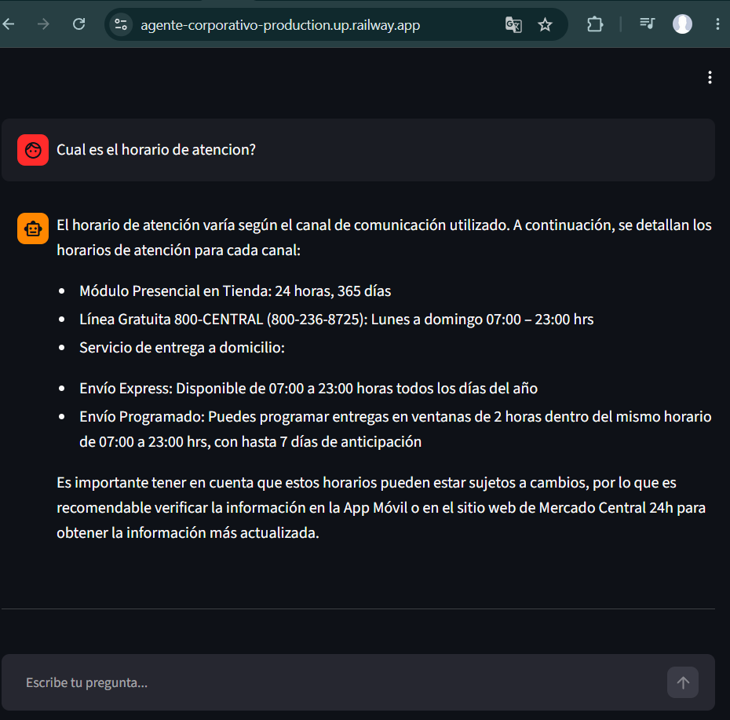
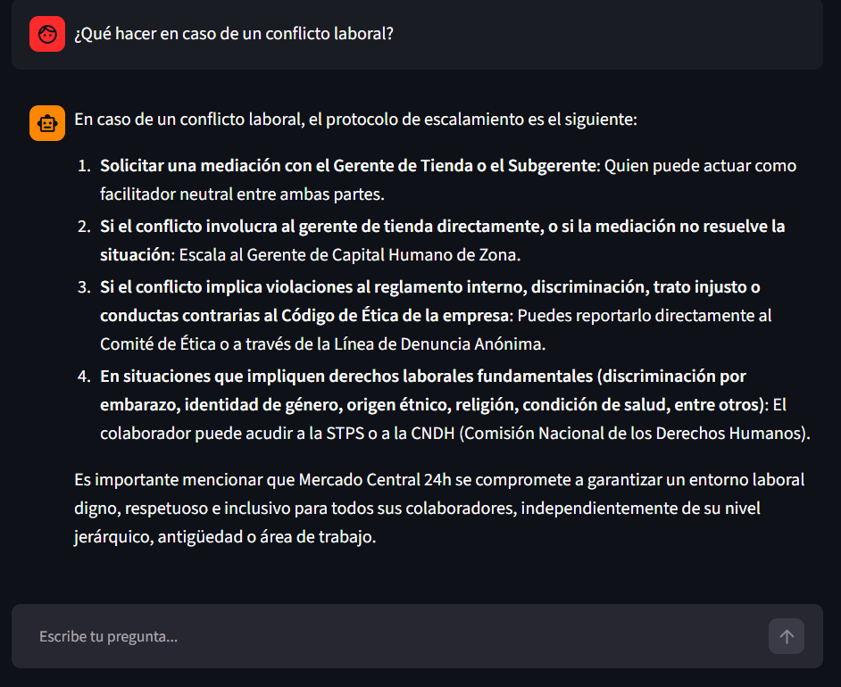
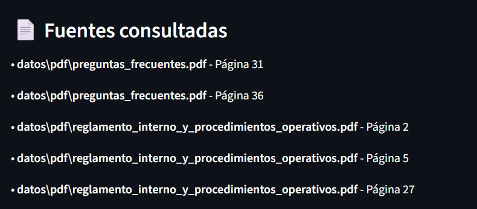
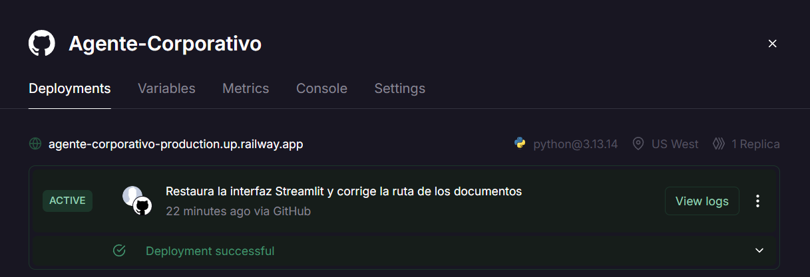

# Agente Inteligente Corporativo - Mercado Central 24h

Agente inteligente desarrollado con **Python, LangChain, FAISS, Streamlit y Groq**, capaz de responder preguntas en lenguaje natural utilizando documentación interna de una empresa.

El sistema emplea la técnica **Retrieval-Augmented Generation (RAG)** para consultar documentos PDF y generar respuestas precisas basadas únicamente en la información disponible.

---

# Descripción

Muchas empresas almacenan grandes cantidades de documentación interna, como manuales, reglamentos, políticas y preguntas frecuentes. Encontrar información específica puede tomar varios minutos o incluso horas.

Este proyecto implementa un asistente inteligente que permite realizar preguntas en lenguaje natural y obtener respuestas fundamentadas en la documentación de la empresa, sin necesidad de revisar manualmente cada archivo.

---

# Características

- Consulta documentación interna mediante lenguaje natural.
- Procesamiento automático de documentos PDF.
- División inteligente del contenido en fragmentos.
- Indexación mediante FAISS.
- Recuperación semántica usando embeddings.
- Generación de respuestas con Groq (Llama 3.3 70B).
- Interfaz web desarrollada con Streamlit.
- Despliegue en la nube mediante Railway.
- Visualización de las fuentes utilizadas para responder cada consulta.

---

# Arquitectura

```
                Usuario
                    │
                    ▼
             Interfaz Streamlit
                    │
                    ▼
             Consulta del usuario
                    │
                    ▼
              Retriever (FAISS)
                    │
        Recuperación de documentos
                    │
                    ▼
           Prompt + Contexto
                    │
                    ▼
        Modelo LLM (Groq - Llama 3.3)
                    │
                    ▼
               Respuesta final
                    │
                    ▼
         Documentos utilizados
```

---

# Estructura del proyecto

```
Agente-Corporativo/

│
├── app.py
├── main.py
├── requirements.txt
├── README.md
│
├── datos
│   ├── PDF
│   └── faiss
│
└── src
    ├── llm.py
    ├── procesamiento_documentos.py
    └── rag.py
```

---

# Tecnologías utilizadas

- Python
- Streamlit
- LangChain
- LangChain Groq
- HuggingFace Embeddings
- FAISS
- Sentence Transformers
- PyMuPDF
- Railway

---

# Base de conocimiento

El asistente utiliza la siguiente documentación empresarial:

- Manual de proveedores y políticas de compra.
- Política de atención al cliente.
- Reglamento interno y procedimientos operativos.
- Preguntas frecuentes (FAQ).

---

# Instalación

Clonar el repositorio

```bash
git clone https://github.com/SBNGL/Agente-Corporativo.git
```

Entrar al proyecto

```bash
cd Agente-Corporativo
```

Crear entorno virtual

Windows

```bash
python -m venv .venv
```

Activar entorno

```bash
.venv\Scripts\activate
```

Instalar dependencias

```bash
pip install -r requirements.txt
```

---

# Variables de entorno

Crear un archivo **.env**

```env
GROQ_API_KEY=TU_API_KEY
```

---

# Ejecutar la aplicación

```bash
streamlit run app.py
```

---

# Ejemplos de consultas

- ¿Cuál es el procedimiento para registrar un nuevo proveedor?
- ¿Qué canales de atención tiene Mercado Central 24h?
- ¿Cómo funciona la política de devoluciones?
- ¿Qué hacer en caso de conflicto laboral?
- ¿Cuáles son los valores corporativos de la empresa?
- ¿Cómo se realiza una devolución de productos?

---

# Despliegue

La aplicación fue desplegada utilizando **Railway**.

**URL del proyecto**

```
https://agente-corporativo-production.up.railway.app/
```

---

# Evidencias







---

# 📌 Funcionamiento

1. Se cargan los documentos PDF.
2. Se dividen en fragmentos.
3. Se generan embeddings.
4. Se consulta el índice FAISS.
5. Se recupera el contexto más relevante.
6. El modelo Llama 3.3 genera la respuesta.
7. Se muestran las fuentes utilizadas.

---

# Modelo utilizado

**Groq**

Modelo:

```
llama-3.3-70b-versatile
```

---

# Autor

**Sebastian Gomez Lerma**


